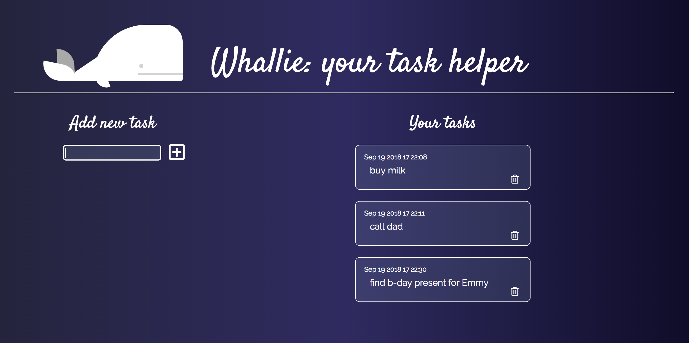

# Whallie: your task manager
## Project overview
This is MVC to-do list that written as educational project for Udacity's Javascript Design Patterns course for how to use MV* frameworks.

## Quick start
Clone the repo and open up index.html in your browser of choice. Add your tasks for the day. Enjoy!